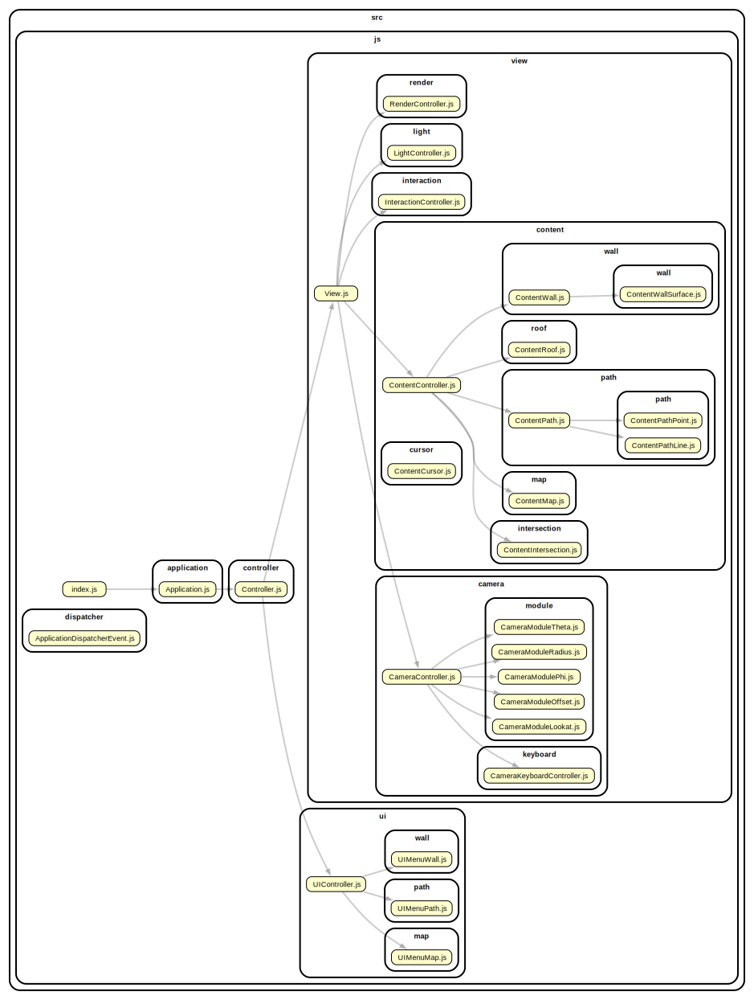
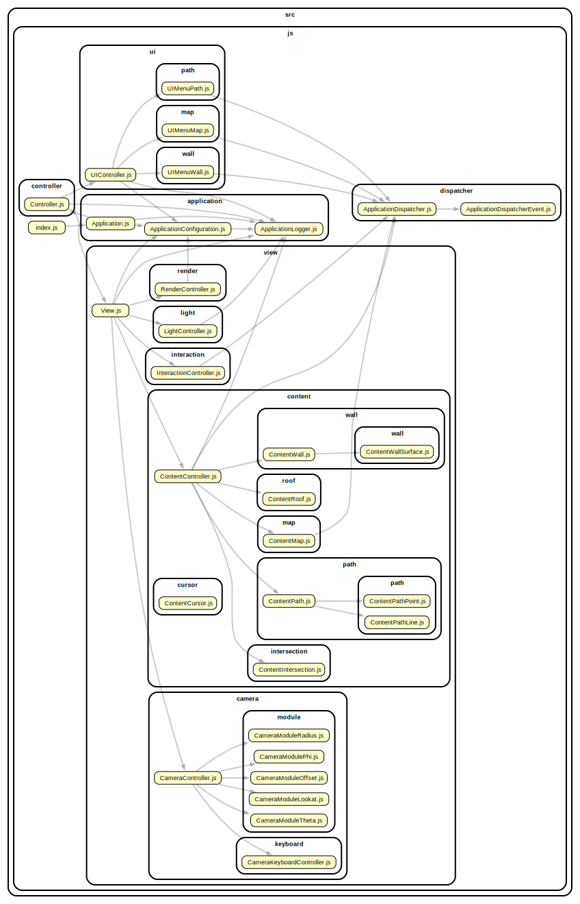

### Three Map Draw Demo

Javascript - Three.js

Deploys to [https://barnabysheeran.com/demo/three-map-draw](https://barnabysheeran.com/demo/three-map-draw)   

### _

`npm install` - Installs dependancies - tested: node 22.20.0 npm 11.6.1  

`npm run start` - Starts development server  
`npm run build` - Builds project to /dist  
`npm run lint` - Lints and lists TODOs in series  

### _

`npm run depcruise` - Updates tool/depcruise (requires GraphViz `dot`)  

Selected  

  

All

